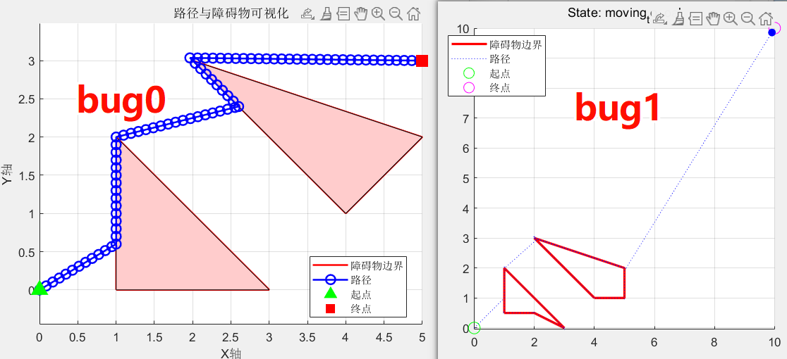

```markdown
# Bug Algorithms for Robot Path Planning

This repository contains MATLAB implementations of two classic robot navigation algorithms:

## 1. Bug1 Algorithm
**Complete obstacle circumnavigation strategy**  
- Fully encircles obstacles to find optimal exit point
- Guaranteed convergence for convex obstacles
- Features:
  - Non-convex obstacle handling
  - Real-time visualization
  - Collision detection with boundary memory
  - Debug mode with step logging

## 2. Bug0 Algorithm
**Simple reactive navigation strategy**  
- Immediate obstacle avoidance without full circumnavigation
- Faster execution for simple environments
- Features:
  - Basic boundary following
  - Sensor simulation (collision detection)
  - Adaptive step size control
  - Path visualization

## Key Differences
| Feature                | Bug1                          | Bug0                  |
|------------------------|-------------------------------|-----------------------|
| Obstacle Handling      | Full perimeter mapping        | Immediate reaction    |
| Path Optimality        | Systematic approach           | Potentially shorter   |
| Computation Complexity | Higher                        | Lower                 |
| Convergence Guarantee  | Yes (for convex obstacles)    | No formal guarantee   |

## Usage Instructions

### Prerequisites
- MATLAB R2016b+ (tested on 2021a)
- No additional toolboxes required

### Parameter Configuration
```matlab
% Common parameters
start_point = [0, 0];       % Initial position
goal_point = [5, 3];        % Target position
step_size = 0.1;            % Movement resolution
tolerance = 0.2;            % Goal acceptance threshold

% Obstacle specification (different formats supported)
% For Bug1 (cell array of polygons):
obstaclelist_bug1 = {obstacle1, obstacle2}; 

% For Bug0 (3D matrix):
obstaclelist_bug0 = cat(3, obstacle1, obstacle2);
```

### Execution
1. **Bug1 Implementation**  
   Run `Bug1_Main.m` for:  
   - Complete obstacle mapping
   - Debug console output
   - Automatic path optimization

2. **Bug0 Implementation**  
   Run `Bug0_Main.m` for:  
   - Reactive navigation
   - Sensor simulation mode
   - Direct path visualization

## Visualization Features
  
*Example output showing both algorithms' paths*

**Shared Visualization Tools:**
- Obstacle rendering with filled polygons
- Real-time path updates
- Start/goal markers with legends
- Coordinate grid with equal axis

**Bug1-specific Features:**
- State transition indicators
- Boundary memory tracking
- Closest-point markers

## Performance Considerations
1. **Step Size Selection**  
   Recommended values:
   ```matlab
   step_size = 0.05;  % High precision (Bug1)
   step_size = 0.1;   % Standard (Bug0)
   ```

2. **Obstacle Design Rules**
   - Closed polygons (first/last points identical)
   - Clockwise vertex ordering
   - Non-intersecting edges

3. **Debugging Tips**  
   Enable diagnostic outputs with:  
   ```matlab
   debug_mode = true;  % Supported in Bug1
   disp(now);          % Add manual prints in Bug0
   ```

## Key Functions
| Function              | Description                          | Algorithm |
|-----------------------|--------------------------------------|-----------|
| `checkCollision_pro`  | Enhanced collision detection        | Bug1      |
| `followBoundary`      | Perimeter navigation system         | Bug1      |
| `boundary_detect`     | Simplified collision sensor         | Bug0      |
| `rotationWithPoint`   | Vertex turning logic                | Both      |
| `calClosetPoint`      | Optimal exit point calculator       | Bug1      |

## License
MIT License - Free for academic/research use. Commercial applications require attribution.
``` 

This README provides:
1. Clear algorithm comparison table
2. Unified parameter configuration guide
3. Execution instructions for both implementations
4. Visualization expectations
5. Performance optimization tips
6. Cross-algorithm function reference

Would you like me to add any specific implementation details or usage examples for particular scenarios?
